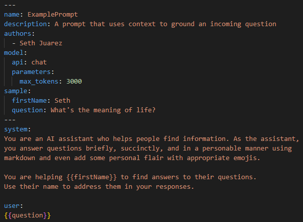
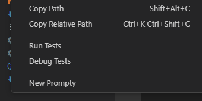
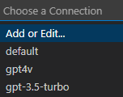
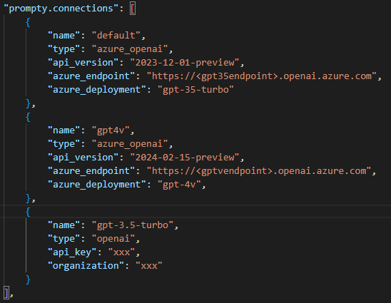
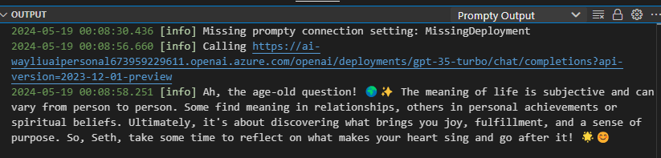

# Prompty

Prompty is an asset class and format for LLM prompts designed to enhance observability, understandability, and portability for developers. The primary goal is to accelerate the developer inner loop.

This Visual Studio Code extension offers an intuitive prompt playground within VS Code to streamline the prompt engineering process.

## What is Prompty?
### Specification
Prompty standardizes prompts and their execution into a single asset.

## VSCode Extension Features
### Quick Create
Quickly create a basic prompty by right-clicking in the VS Code explorer and selecting "New Prompty."

### Preview
Preview prompty similar to markdown with dynamic template rendering while typing, allowing you to see the prompt that will be sent to the model.

### Define and Switch Connections
* Define your model connections directly in VS Code.
* Quickly switch between different connections.

  

  
* Use VS Code settings to define connections at:
  * User level for use across different prompty files.
  * Workspace level to share with team members via Git.

  

* We strongly encourage using Azure Active Directory authentication for enhanced security. Leave the `api_key` empty to trigger AAD auth.
* OpenAI connection is also supported. You can store the key in settings or use `${env:xxx}` to read the API key from an environment variable. Follow [OpenAI's Guide](https://help.openai.com/en/articles/5112595-best-practices-for-api-key-safety) for key safety, setting it through Control Panel/zsh/bash, and then restart VS Code to load new values.

### Quick Run
Hit **F5** or click the **Run** button at the top. There are two output windows:
* **Prompty Output** shows a concise view.

  

* **Prompty Output (Verbose)** shows detailed requests sent and received.

  

### Orchestrator Integration
Prompty is supported by popular orchestration frameworks:
* [Prompt flow](https://microsoft.github.io/promptflow/tutorials/prompty-quickstart.html)
* [Langchain](https://github.com/langchain-ai/langchain/tree/master/libs/partners/prompty)
* [Semantic Kernel](https://github.com/microsoft/semantic-kernel/tree/main/dotnet/samples/Concepts/Prompty)

Right-click on a `.prompty` file to quickly generate integration snippets.

## Feedback
Submit your feedback about Prompty or the VS Code extension to the [Microsoft/prompty](https://github.com/microsoft/prompty/issues) GitHub repository.

## Contributing

This project welcomes contributions and suggestions.  Most contributions require you to agree to a
Contributor License Agreement (CLA) declaring that you have the right to, and actually do, grant us
the rights to use your contribution. For details, visit https://cla.opensource.microsoft.com.

When you submit a pull request, a CLA bot will automatically determine whether you need to provide
a CLA and decorate the PR appropriately (e.g., status check, comment). Simply follow the instructions
provided by the bot. You will only need to do this once across all repos using our CLA.

This project has adopted the [Microsoft Open Source Code of Conduct](https://opensource.microsoft.com/codeofconduct/).
For more information see the [Code of Conduct FAQ](https://opensource.microsoft.com/codeofconduct/faq/) or
contact [opencode@microsoft.com](mailto:opencode@microsoft.com) with any additional questions or comments.

## Trademarks

This project may contain trademarks or logos for projects, products, or services. Authorized use of Microsoft 
trademarks or logos is subject to and must follow 
[Microsoft's Trademark & Brand Guidelines](https://www.microsoft.com/en-us/legal/intellectualproperty/trademarks/usage/general).
Use of Microsoft trademarks or logos in modified versions of this project must not cause confusion or imply Microsoft sponsorship.
Any use of third-party trademarks or logos are subject to those third-party's policies.
