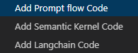

# Prompty

Prompty is an asset class and format for LLM prompts designed to enhance observability, understandability, and portability for developers. The primary goal is to accelerate the developer inner loop.

This Visual Studio Code extension offers an intuitive prompt playground within VS Code to streamline the prompt engineering process. You can find the Pormpty extension in the [Visual Studio Code Marketplace](https://marketplace.visualstudio.com/items?itemName=ms-toolsai.prompty).

## What is Prompty?
### Specification
Prompty standardizes prompts and their execution into a single asset.

## VSCode Extension Features
### Quick Create
Quickly create a basic prompty by right-clicking in the VS Code explorer and selecting "New Prompty."

### Preview
Preview prompty similar to markdown with dynamic template rendering while typing, allowing you to see the prompt that will be sent to the model.

### Define and Switch Model Configurations
* Define your model configurations directly in VS Code.
* Quickly switch between different model configurations.

  

  
* Use VS Code settings to define model configuration at:
  * User level for use across different prompty files.
  * Workspace level to share with team members via Git.

    

* We strongly encourage using Azure Active Directory authentication for enhanced security. Leave the `api_key` empty to trigger AAD auth.
* OpenAI is also supported. You can store the key in VSCode settings or use `${env:xxx}` to read the API key from an environment variable.
  * You can put environment variables in `.env` file, in the same folder of the prompty file, or in the workspace root folder.
  * Alternatively, you can also specify it in system variables, follow [OpenAI's Guide](https://help.openai.com/en/articles/5112595-best-practices-for-api-key-safety) for key safety, setting it through Control Panel/zsh/bash, and then restart VS Code to load new values.

### Quick Run
Hit **F5** or click the **Run** button at the top. There are two output windows:
* **Prompty Output** shows a concise view.

  

* **Prompty Output (Verbose)** shows detailed requests sent and received.

  

### Orchestrator Integration
Prompty is supported by popular orchestration frameworks:
* [Prompt flow](https://microsoft.github.io/promptflow/tutorials/prompty-quickstart.html)
* [Langchain](https://github.com/langchain-ai/langchain/tree/master/libs/partners/prompty)
* [Semantic Kernel](https://github.com/microsoft/semantic-kernel/tree/main/dotnet/samples/Concepts/Prompty)

Right-click on a `.prompty` file to quickly generate integration snippets.

## Feedback
Submit your feedback about Prompty or the VS Code extension to the [Microsoft/prompty](https://github.com/microsoft/prompty/issues) GitHub repository.

## Documentation
* https://microsoft.github.io/prompty/
