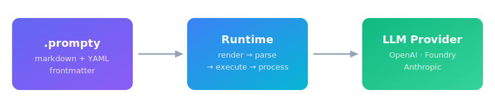
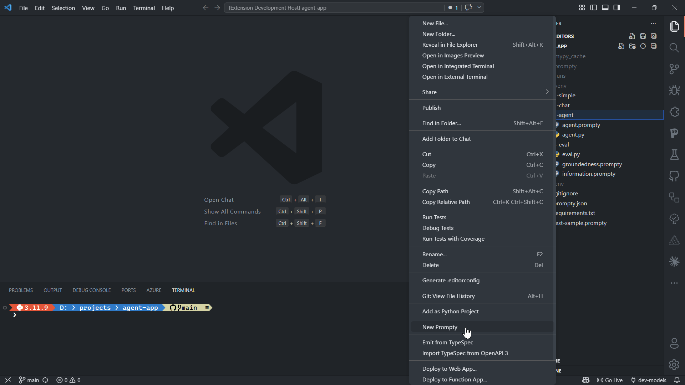
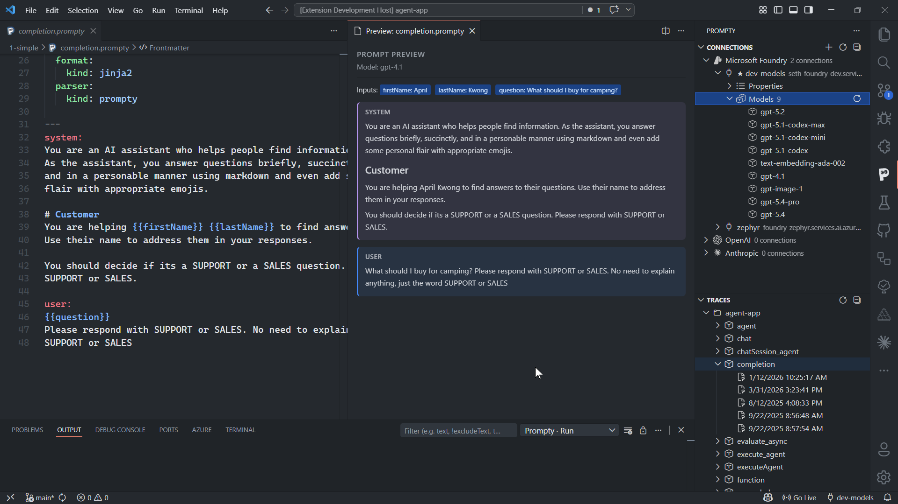
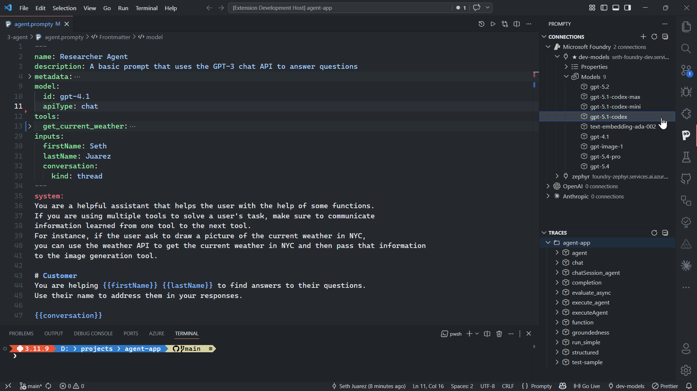
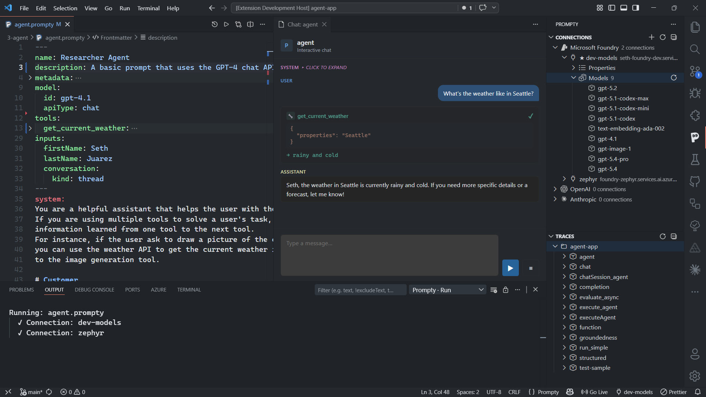
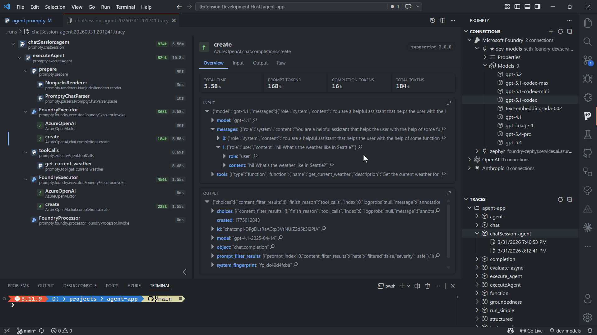

# Prompty

[](https://pypi.org/project/prompty/)
[](https://www.npmjs.com/package/@prompty/core)
[](https://marketplace.visualstudio.com/items?itemName=ms-toolsai.prompty)

> **⚠️ v2 Alpha** — This is the v2 branch of Prompty, currently in alpha. The API, file format, and tooling are under active development and may change. Feedback welcome via [Issues](https://github.com/microsoft/prompty/issues).

Prompty is a **markdown file format** (`.prompty`) for LLM prompts. Write your prompt once — run it from VS Code, Python, or TypeScript.

<p align="center">
  
</p>

## Quick Start

### 1. Write a `.prompty` file

```prompty
---
name: greeting
model:
  id: gpt-4o-mini
  provider: openai
  connection:
    kind: key
    apiKey: ${env:OPENAI_API_KEY}
template:
  format:
    kind: jinja2
  parser:
    kind: prompty
---
system:
You are a friendly assistant.

user:
Say hello to {{name}}.
```

### 2. Run it

**Python**
```bash
pip install "prompty[jinja2,openai]"
```
```python
import prompty

result = prompty.invoke("greeting.prompty", inputs={"name": "Jane"})
print(result)
```

**TypeScript**
```bash
npm install @prompty/core @prompty/openai
```
```typescript
import { invoke } from "@prompty/core";
import "@prompty/openai";

const result = await invoke("greeting.prompty", { name: "Jane" });
console.log(result);
```

**VS Code** — open the `.prompty` file and press **F5**.

### Use an OpenAI-compatible endpoint

Prompty's `openai` provider can also target OpenAI-compatible control planes,
gateways, or self-hosted model servers by setting `model.connection.endpoint`.
The prompt asset stays portable: switch the endpoint and key at runtime without
changing the prompt body.

```prompty
---
name: governed-greeting
model:
  id: gpt-4o-mini
  provider: openai
  connection:
    kind: key
    endpoint: ${env:OPENAI_BASE_URL:https://api.openai.com/v1}
    apiKey: ${env:OPENAI_API_KEY}
template:
  format:
    kind: jinja2
  parser:
    kind: prompty
---
system:
You are a careful assistant.

user:
Say hello to {{name}}.
```

For example, to route through Tuning Engines:

```bash
export OPENAI_BASE_URL=https://api.tuningengines.com/v1
export OPENAI_API_KEY=sk-te-your-inference-key
```

This keeps the `.prompty` file unchanged while the endpoint provides routing,
policy, usage tracking, or trace correlation around OpenAI-compatible calls.

## Contributor hygiene

Prompty normalizes text files to LF line endings via `.gitattributes`. Enable the
repo hook once per clone so staged files are normalized before each commit and
whitespace errors are blocked locally:

```bash
git config core.hooksPath .githooks
```

Before opening a PR, you can run the same core hygiene checks directly:

```bash
git diff --check
git ls-files --eol | grep 'w/crlf'
```

## VS Code Extension

The v2 extension includes a connections sidebar, live preview, chat mode, and a redesigned trace viewer.

### Create

Right-click in the explorer → **New Prompty** to scaffold a new prompt file.



### Preview

See the rendered prompt with live markdown rendering and template interpolation as you type.



### Connections

Manage model connections from the sidebar — add OpenAI, Microsoft Foundry, or Anthropic endpoints, set a default, and browse available models.



### Chat Mode

Thread-enabled prompts automatically open an interactive chat panel with tool calling support.



### Tracing

Every execution generates a `.tracy` trace file. Click to inspect the full pipeline — render, parse, execute, process — with timing and payloads.



## Runtimes

### Python

```bash
pip install "prompty[all]"              # everything
pip install "prompty[jinja2,openai]"    # just OpenAI
pip install "prompty[jinja2,foundry]"   # Microsoft Foundry
pip install "prompty[jinja2,anthropic]" # Anthropic
```

```python
import prompty

# Full pipeline: load → render → parse → execute → process
result = prompty.invoke("my-prompt.prompty", inputs={...})

# Step-by-step
agent = prompty.load("my-prompt.prompty")
messages = prompty.prepare(agent, inputs={...})
result = prompty.run(agent, messages)

# Async
result = await prompty.invoke_async("my-prompt.prompty", inputs={...})
```

See [runtime/python/prompty/README.md](runtime/python/prompty/README.md) for full API docs.

### TypeScript

```bash
npm install @prompty/core @prompty/openai   # OpenAI
npm install @prompty/core @prompty/foundry  # Microsoft Foundry
npm install @prompty/core @prompty/anthropic # Anthropic
```

```typescript
import { load, prepare, run, invoke } from "@prompty/core";
import "@prompty/openai"; // registers the provider

// Full pipeline
const result = await invoke("my-prompt.prompty", { name: "Jane" });

// Step-by-step
const agent = await load("my-prompt.prompty");
const messages = await prepare(agent, { name: "Jane" });
const result = await run(agent, messages);
```

See [runtime/typescript/packages/core/README.md](runtime/typescript/packages/core/README.md) for full API docs.

## `.prompty` File Format

A `.prompty` file has two parts: **YAML frontmatter** (model config, inputs, tools) and a **markdown body** (the prompt with role markers and template syntax).

```prompty
---
name: my-prompt
model:
  id: gpt-4o
  provider: foundry
  connection:
    kind: key
    endpoint: ${env:AZURE_OPENAI_ENDPOINT}
    apiKey: ${env:AZURE_OPENAI_API_KEY}
  options:
    temperature: 0.7
inputs:
  - name: question
    kind: string
    default: What is the meaning of life?
tools:
  - name: get_weather
    kind: function
    description: Get the current weather
    parameters:
      - name: location
        kind: string
template:
  format:
    kind: jinja2
  parser:
    kind: prompty
---
system:
You are a helpful assistant.

user:
{{question}}
```

### Role markers

Lines starting with `system:`, `user:`, or `assistant:` define message boundaries.

### Template syntax

Jinja2 (`{{variable}}`, ``, ``) or Mustache (`{{variable}}`, `{{#section}}`).

### Variable references

| Syntax | Purpose |
|--------|---------|
| `${env:VAR}` | Environment variable (required) |
| `${env:VAR:default}` | With fallback value |
| `${file:path.json}` | Load file content from the prompt directory tree |

`${file:...}` references are scoped to the containing `.prompty` file's directory by default. Host applications can opt into additional allowed roots through runtime load options; prompts cannot grant themselves broader filesystem access.

### Legacy format

Prompty v1 files are automatically migrated with deprecation warnings. See the [Python README](runtime/python/prompty/README.md#legacy-format-support) for details.

## Contributing

See [SUPPORT.md](SUPPORT.md) for help and [CODE_OF_CONDUCT.md](CODE_OF_CONDUCT.md) for community guidelines.

To release a new version, see [RELEASING.md](RELEASING.md).

## License

[MIT](LICENSE)
