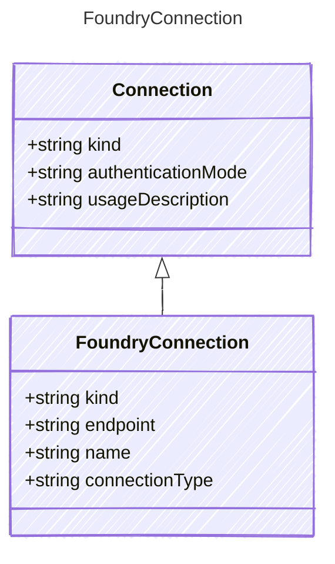

Connection configuration for Microsoft Foundry projects.
Provides project-scoped access to models, tools, and services
via Entra ID (DefaultAzureCredential) authentication.

## Class Diagram



## Yaml Example

```yaml
kind: foundry
endpoint: https://myresource.services.ai.azure.com/api/projects/myproject
name: my-openai-connection
connectionType: model
```

## Properties

| Name | Type | Description |
| ---- | ---- | ----------- |
| kind | string | The connection kind for Foundry project access |
| endpoint | string | The Foundry project endpoint URL |
| name | string | The named connection within the Foundry project |
| connectionType | string | The connection type within the Foundry project (e.g., &#39;model&#39;, &#39;index&#39;, &#39;storage&#39;) |
