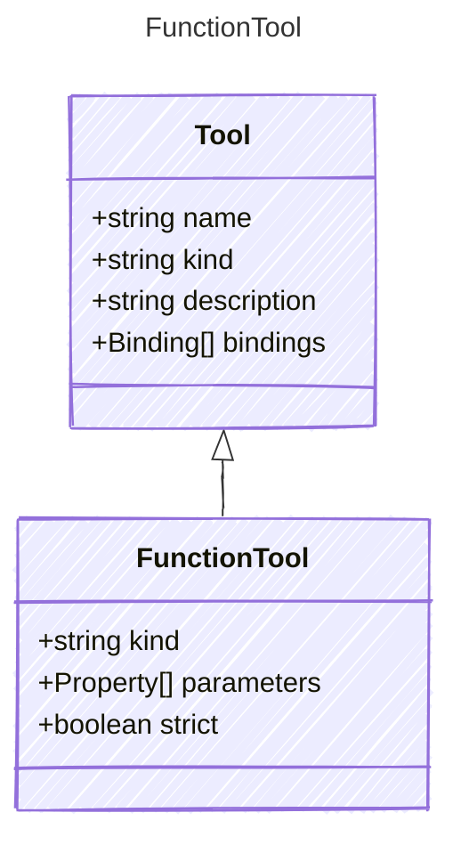

Represents a local function tool.

## Class Diagram



## Yaml Example

```yaml
kind: function
parameters:
  firstName:
    kind: string
    default: Jane
  lastName:
    kind: string
    default: Doe
  question:
    kind: string
    default: What is the meaning of life?
strict: true
```

## Properties

| Name | Type | Description |
| ---- | ---- | ----------- |
| kind | string | The kind identifier for function tools |
| parameters | [Property[]](../property/) | Parameters accepted by the function tool |
| strict | boolean | Indicates whether the function tool enforces strict validation on its parameters |
