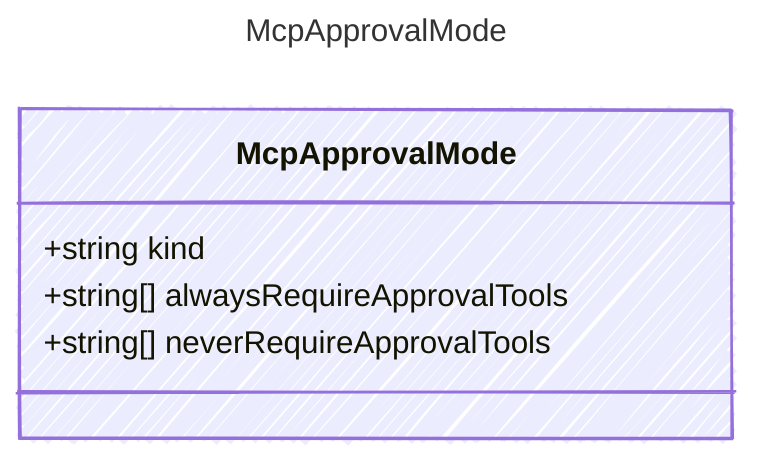

The approval mode for MCP server tools.
When kind is &quot;specify&quot;, use alwaysRequireApprovalTools and neverRequireApprovalTools
to control per-tool approval. For &quot;always&quot; and &quot;never&quot;, those fields are ignored.

## Class Diagram



## Yaml Example

```yaml
kind: never
alwaysRequireApprovalTools:
  - operation1
neverRequireApprovalTools:
  - operation2
```

## Properties

| Name | Type | Description |
| ---- | ---- | ----------- |
| kind | string | The approval mode: &#39;always&#39;, &#39;never&#39;, or &#39;specify&#39; |
| alwaysRequireApprovalTools | string[] | List of tools that always require approval (only used when kind is &#39;specify&#39;) |
| neverRequireApprovalTools | string[] | List of tools that never require approval (only used when kind is &#39;specify&#39;) |

## Alternate Constructions

The following alternate constructions are available for `McpApprovalMode`.
These allow for simplified creation of instances using a single property.

### string kind

Mcp Approval Mode

The following simplified representation can be used:

```yaml
kind: "example"
```

This is equivalent to the full representation:

```yaml
kind:
  kind: "example"
```
