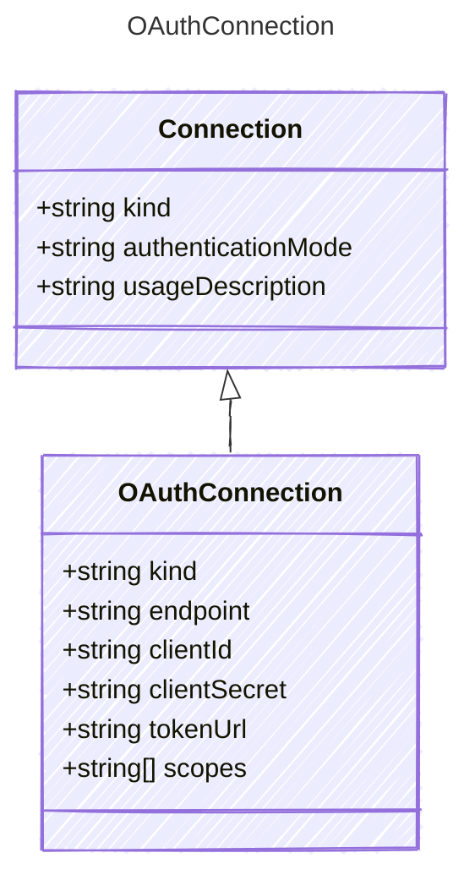

Connection configuration using OAuth 2.0 client credentials.
Useful for tools and services that require OAuth authentication,
such as MCP servers, OpenAPI endpoints, or other REST APIs.

## Class Diagram



## Yaml Example

```yaml
kind: oauth
endpoint: https://api.example.com
clientId: your-client-id
clientSecret: your-client-secret
tokenUrl: https://login.microsoftonline.com/{tenant}/oauth2/v2.0/token
scopes:
  - https://cognitiveservices.azure.com/.default
```

## Properties

| Name | Type | Description |
| ---- | ---- | ----------- |
| kind | string | The connection kind for OAuth authentication |
| endpoint | string | The endpoint URL for the service |
| clientId | string | The OAuth client ID |
| clientSecret | string | The OAuth client secret |
| tokenUrl | string | The OAuth token endpoint URL |
| scopes | string[] | OAuth scopes to request |
