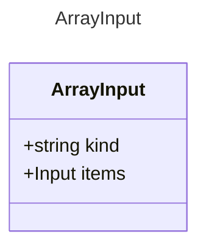

# ArrayInput

Represents an array output property.
This extends the base Output model to represent an array of items.

## Class Diagram




## Yaml Example
```yaml
items:
  kind: string

```


## Properties

| Name | Type | Description |
| ---- | ---- | ----------- |
| kind | string |   |
| items | [Input](Input.md) | The type of items contained in the array <p>Related Types:<ul><li>[ObjectInput](ObjectInput.md)</li></ul></p> |


