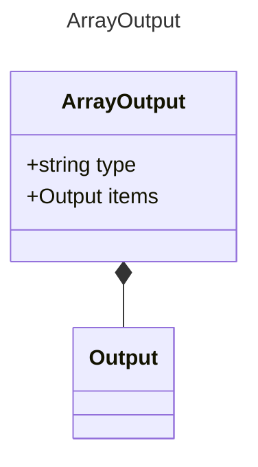

# ArrayOutput

Represents an array output property.
This extends the base Output model to represent an array of items.

## Class Diagram

## Properties

| Name | Type | Description |
| ---- | ---- | ----------- |
| type | string |   |
| items | [Output](Output.md) | The type of items contained in the array 
Related Types:<ul><li>[ObjectOutput](ObjectOutput.md)</li></ul>
 |

