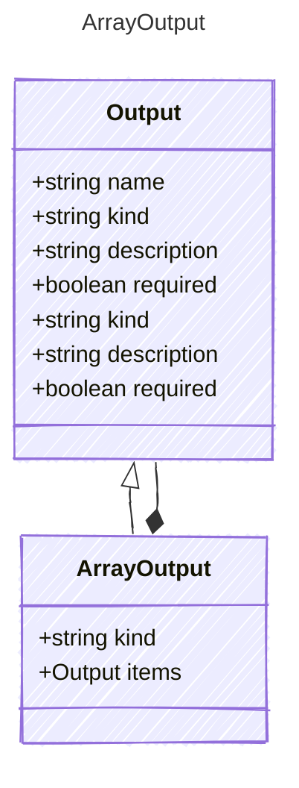

# ArrayOutput

Represents an array output property.
This extends the base Output model to represent an array of items.

## Class Diagram



## Yaml Example

```yaml
items:
  kind: string

```

## Properties

| Name | Type | Description |
| ---- | ---- | ----------- |
| kind | string |   |
| items | [Output](Output.md) | The type of items contained in the array (Related Types: [ObjectOutput](ObjectOutput.md)) |

## Composed Types

The following types are composed within `ArrayOutput`:

- [Output](Output.md)
