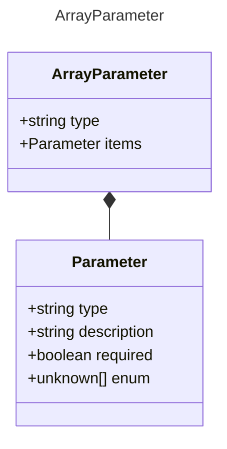

# ArrayParameter

Represents an array parameter for a tool.

## Class Diagram

## Properties

| Name | Type | Description |
| ---- | ---- | ----------- |
| type | string |   |
| items | [Parameter](Parameter.md) | The type of items contained in the array  |

