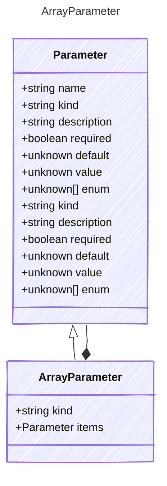

# ArrayParameter

Represents an array parameter for a tool.

## Class Diagram



## Yaml Example

```yaml
items:
  kind: string

```

## Properties

| Name | Type | Description |
| ---- | ---- | ----------- |
| kind | string |   |
| items | [Parameter](Parameter.md) | The kind of items contained in the array  |

## Composed Types

The following types are composed within `ArrayParameter`:

- [Parameter](Parameter.md)
