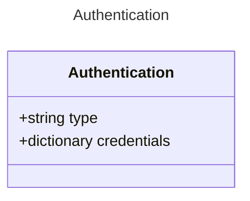

# Authentication

Authentication configuration for the MCP tool

## Class Diagram

## Properties

| Name | Type | Description |
| ---- | ---- | ----------- |
| type | string | The type of authentication to use  |
| credentials | dictionary | The credentials to use for authentication  |

