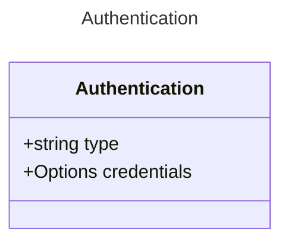

# Authentication

## Class Diagram

## Properties

| Name | Type | Description |
| ---- | ---- | ----------- |
| type | string | The type of authentication to use  |
| credentials | [Options](Options.md) | The credentials to use for authentication  |

