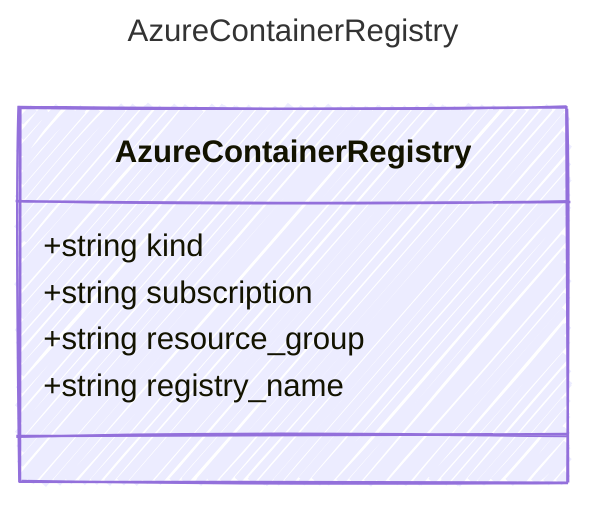

# AzureContainerRegistry

## Class Diagram

## Properties

| Name | Type | Description |
| ---- | ---- | ----------- |
| kind | string |   |
| subscription | string |   |
| resource_group | string |   |
| registry_name | string |   |
