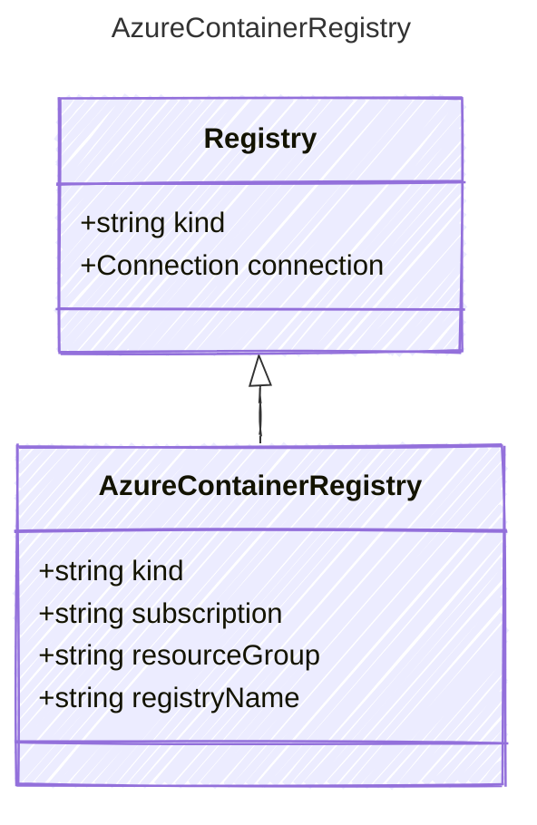

# AzureContainerRegistry

Definition for an Azure Container Registry (ACR).

## Class Diagram



## Yaml Example

```yaml
kind: acr
subscription: your-subscription-id
resourceGroup: your-resource-group
registryName: your-acr-name

```

## Properties

| Name | Type | Description |
| ---- | ---- | ----------- |
| kind | string | The kind of container registry  |
| subscription | string | The Azure subscription ID for the ACR  |
| resourceGroup | string | The Azure resource group containing the ACR  |
| registryName | string | The name of the ACR  |
