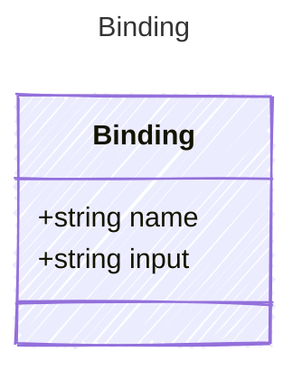

# Binding

Represents a binding between an input property and a tool parameter.

## Class Diagram



## Yaml Example

```yaml
name: my-tool
input: input-variable

```

## Properties

| Name | Type | Description |
| ---- | ---- | ----------- |
| name | string | Name of the binding  |
| input | string | The input property that will be bound to the tool parameter argument  |
