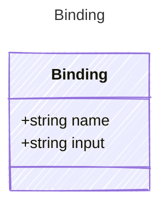

# Binding

Represents a binding between an input property and a tool parameter.

## Class Diagram



## Yaml Example

```yaml
name: my-tool
input: input-variable

```

## Properties

| Name | Type | Description |
| ---- | ---- | ----------- |
| name | string | Name of the binding  |
| input | string | The input property that will be bound to the tool parameter argument  |

## Alternate Constructions

The following alternate constructions are available for `Binding`.
These allow for simplified creation of instances using a single property.

### string

The following simplified representation can be used:

```yaml
value: "example"

```

This is equivalent to the full representation:

```yaml
value:
  input: "example"

```
