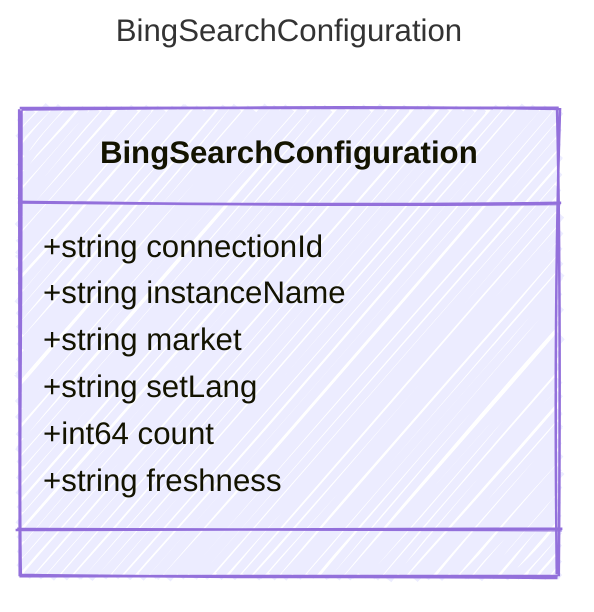

# BingSearchConfiguration

Configuration options for the Bing search tool.

## Class Diagram

## Properties

| Name | Type | Description |
| ---- | ---- | ----------- |
| connectionId | string | Connection id for grounding with bing search  |
| instanceName | string | The instance name of the Bing search tool, used to identify the specific instance in the system  |
| market | string | The market where the results come from.  |
| setLang | string | The language to use for user interface strings when calling Bing API.  |
| count | int64 | The number of search results to return in the bing api response  |
| freshness | string | Filter search results by a specific time range. Accepted values: <https://learn.microsoft.com/bing/search-apis/bing-web-search/reference/query-parameters>  |
