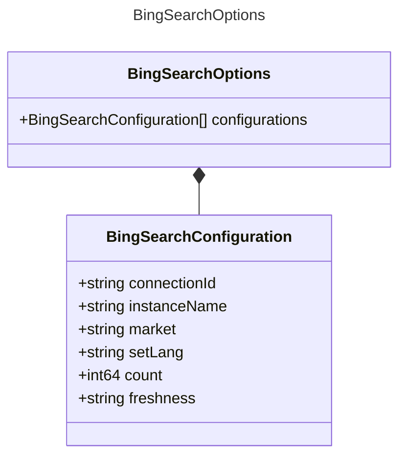

# BingSearchOptions

Options for the Bing search tool.

## Class Diagram

## Properties

| Name | Type | Description |
| ---- | ---- | ----------- |
| configurations | [BingSearchConfiguration Collection](BingSearchConfiguration.md) |   |

