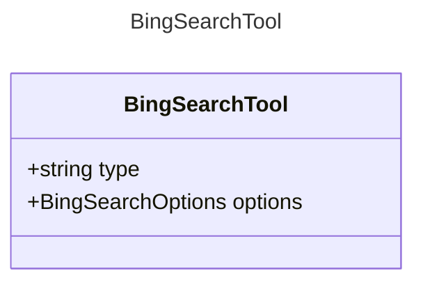

# BingSearchTool

The Bing search tool.

## Class Diagram

## Properties

| Name | Type | Description |
| ---- | ---- | ----------- |
| type | string | The type identifier for Bing search tools  |
| options | [BingSearchOptions](BingSearchOptions.md) | The options for the Bing search tool  |

