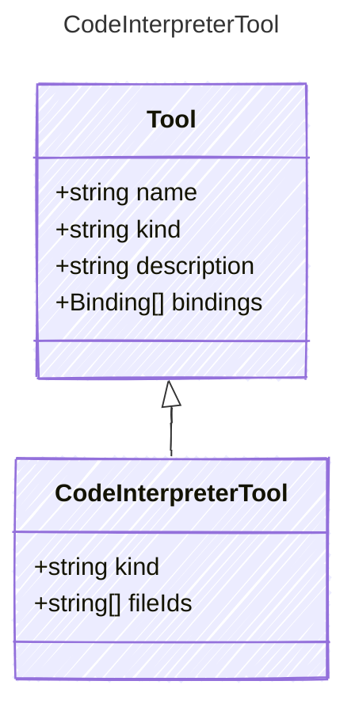

# CodeInterpreterTool

A tool for interpreting and executing code.
This tool allows an AI agent to run code snippets and analyze data files.

## Class Diagram



## Yaml Example

```yaml
kind: code_interpreter
fileIds:
  - file1
  - file2

```

## Properties

| Name | Type | Description |
| ---- | ---- | ----------- |
| kind | string | The kind identifier for code interpreter tools  |
| fileIds | string[] | The IDs of the files to be used by the code interpreter tool.  |
