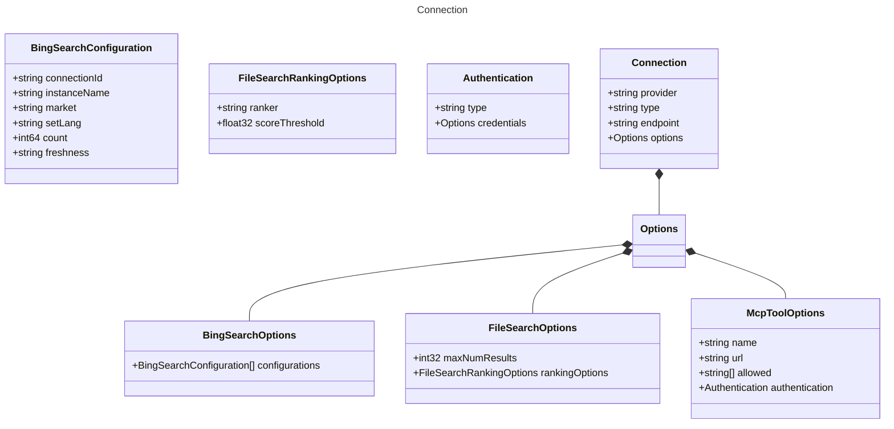

# Connection

Connection configuration for AI agents.
`provider`, `type`, and `endpoint` are required properties here,
but this section can accept additional via options.

## Class Diagram

## Properties

| Name | Type | Description |
| ---- | ---- | ----------- |
| provider | string | The unique provider of the connection  |
| type | string | The type of connection used to tell the runtime how to load and execute the agent  |
| endpoint | string | The endpoint URL for the connection  |
| options | [Options](Options.md) | Additional options for model execution 
Related Types:<ul><li>[BingSearchOptions](BingSearchOptions.md)</li><li>[FileSearchOptions](FileSearchOptions.md)</li><li>[McpToolOptions](McpToolOptions.md)</li></ul>
 |

