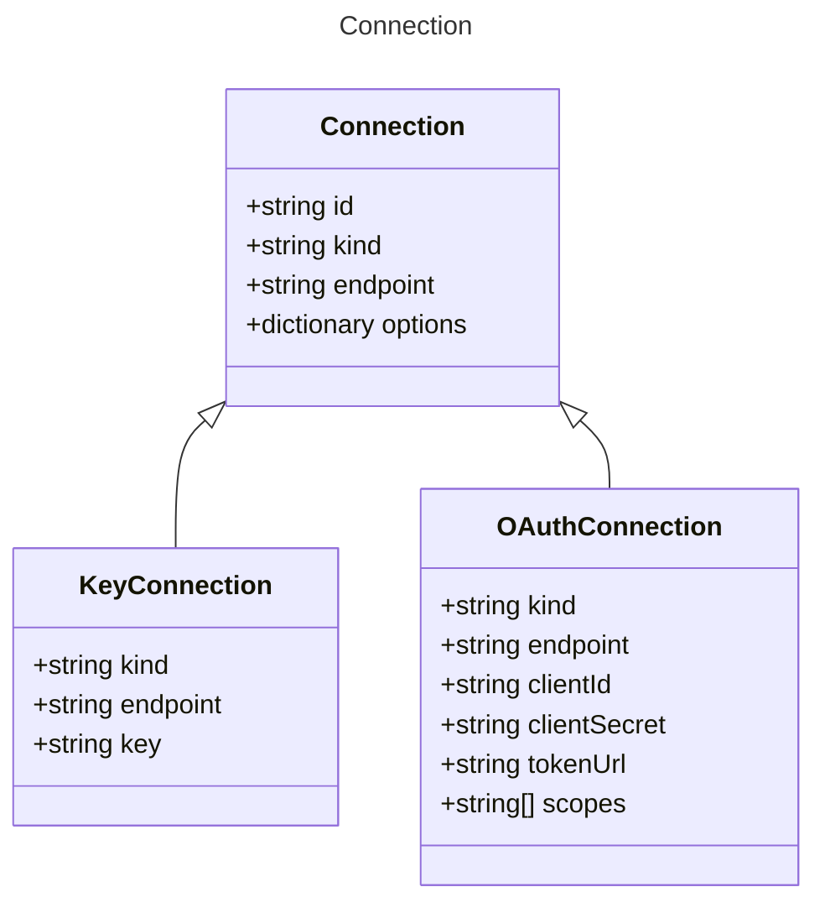

# Connection

Connection configuration for AI agents.
`provider`, `kind`, and `endpoint` are required properties here,
but this section can accept additional via options.

## Class Diagram




## Yaml Example
```yaml
id: my-connection
kind: key
endpoint: https://{your-custom-endpoint}.openai.azure.com/

```


## Properties

| Name | Type | Description |
| ---- | ---- | ----------- |
| id | string | The unique identifier of the connection - can be used as the single property shorthand  |
| kind | string | The Authentication kind for the AI service (e.g., &#39;key&#39; for API key, &#39;oauth&#39; for OAuth tokens)  |
| endpoint | string | The endpoint URL for the AI service  |
| options | dictionary | Additional options for the connection  |


## Child Types

The following types extend `Connection`:
- [KeyConnection](KeyConnection.md)
- [OAuthConnection](OAuthConnection.md)

