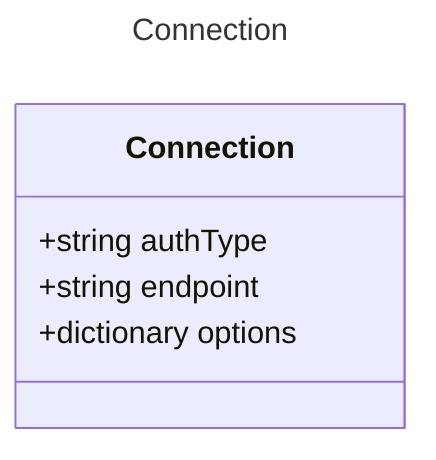

# Connection

Connection configuration for AI agents.
`provider`, `type`, and `endpoint` are required properties here,
but this section can accept additional via options.

## Class Diagram




## Yaml Example
```yaml
authType: key
endpoint: https://{your-custom-endpoint}.openai.azure.com/

```


## Properties

| Name | Type | Description |
| ---- | ---- | ----------- |
| authType | string | The Authentication type for the AI service (e.g., &#39;key&#39; for API key, &#39;oauth&#39; for OAuth tokens)  |
| endpoint | string | The endpoint URL for the AI service  |
| options | dictionary | Additional options for the connection  |


