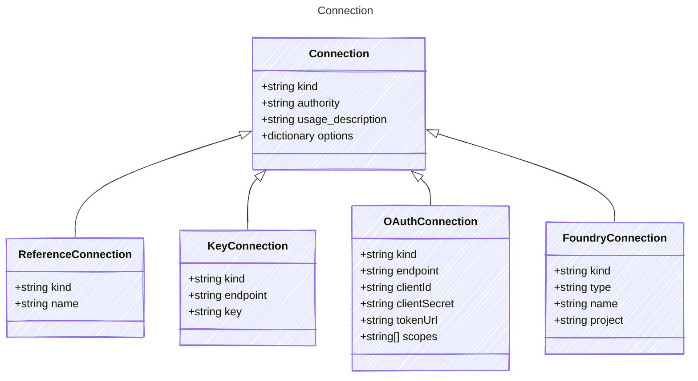

# Connection

Connection configuration for AI agents.
`provider`, `kind`, and `endpoint` are required properties here,
but this section can accept additional via options.

## Class Diagram



## Yaml Example

```yaml
kind: oauth
authority: system
usage_description: This will allow the agent to respond to an email on your behalf

```

## Properties

| Name | Type | Description |
| ---- | ---- | ----------- |
| kind | string | The Authentication kind for the AI service (e.g., &#39;key&#39; for API key, &#39;oauth&#39; for OAuth tokens)  |
| authority | string | The authority level for the connection, indicating under whose authority the connection is made (e.g., &#39;user&#39;, &#39;agent&#39;, &#39;system&#39;)  |
| usage_description | string | The usage description for the connection, providing context on how this connection will be used  |
| options | dictionary | Additional options for the connection  |

## Child Types

The following types extend `Connection`:

- [ReferenceConnection](ReferenceConnection.md)
- [KeyConnection](KeyConnection.md)
- [OAuthConnection](OAuthConnection.md)
- [FoundryConnection](FoundryConnection.md)
