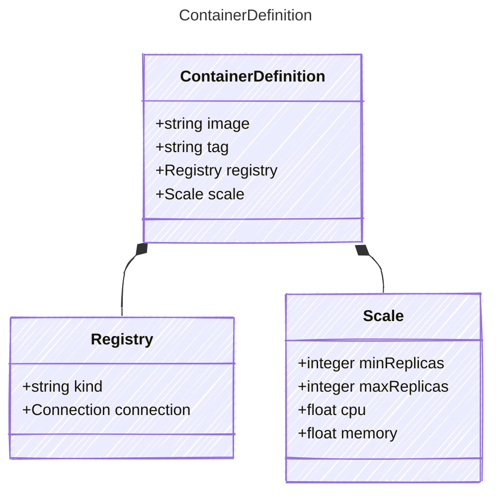

# ContainerDefinition

Definition for a containerized AI agent.

## Class Diagram



## Yaml Example

```yaml
image: my-container-image
tag: v1.0.0
registry:
  kind: acr
  connection:
    kind: key
    authority: system
    usageDescription: Access to the container registry
scale:
  minReplicas: 1
  maxReplicas: 5
  cpu: 0.5
  memory: 2

```

## Properties

| Name | Type | Description |
| ---- | ---- | ----------- |
| image | string | The container image name  |
| tag | string | The container image tag (defaults to &#39;latest&#39; if not specified)  |
| registry | [Registry](Registry.md) | Container image registry definition (Related Types: [GenericRegistry](GenericRegistry.md), [AzureContainerRegistry](AzureContainerRegistry.md)) |
| scale | [Scale](Scale.md) | Instance scaling configuration  |

## Composed Types

The following types are composed within `ContainerDefinition`:

- [Registry](Registry.md)
- [Scale](Scale.md)
