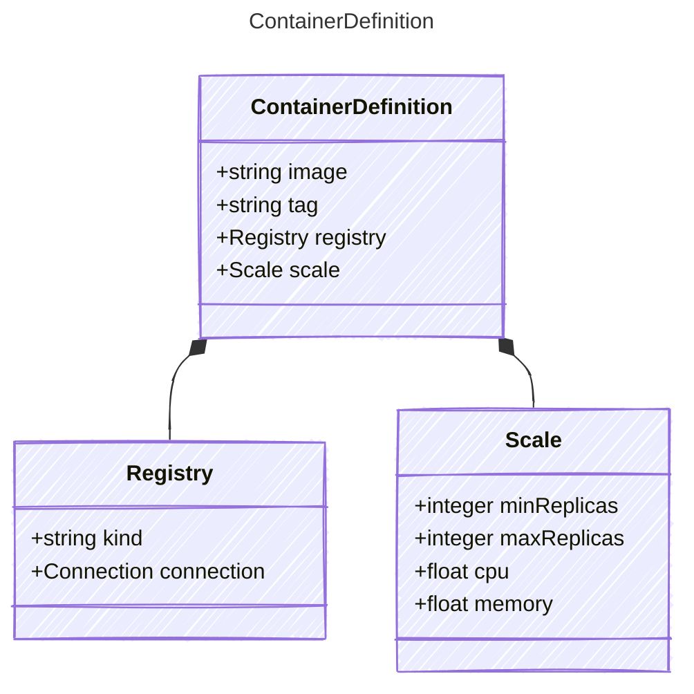

# ContainerDefinition

## Class Diagram

## Properties

| Name | Type | Description |
| ---- | ---- | ----------- |
| image | string |   |
| tag | string |   |
| registry | [Registry](Registry.md) | Container image registry definition (Related Types: [AzureContainerRegistry](AzureContainerRegistry.md)) |
| scale | [Scale](Scale.md) | Instance scaling configuration  |

## Composed Types

The following types are composed within `ContainerDefinition`:

- [Registry](Registry.md)
- [Scale](Scale.md)
