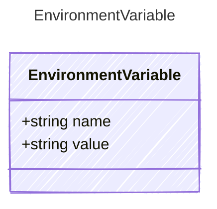

# EnvironmentVariable

Definition for an environment variable used in containerized agents.

## Class Diagram



## Yaml Example

```yaml
name: MY_ENV_VAR
value: my-value

```

## Properties

| Name | Type | Description |
| ---- | ---- | ----------- |
| name | string | Name of the environment variable  |
| value | string | Environment variable resolution  |

## Alternate Constructions

The following alternate constructions are available for `EnvironmentVariable`.
These allow for simplified creation of instances using a single property.

### string

The following simplified representation can be used:

```yaml
value: "example"

```

This is equivalent to the full representation:

```yaml
value:
  value: "example"

```
