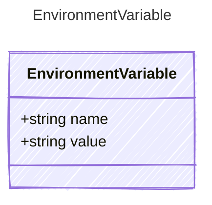

# EnvironmentVariable

Definition for an environment variable used in containerized agents.

## Class Diagram



## Yaml Example

```yaml
name: MY_ENV_VAR
value: my-value

```

## Properties

| Name | Type | Description |
| ---- | ---- | ----------- |
| name | string | Name of the environment variable  |
| value | string | Environment variable resolution  |
