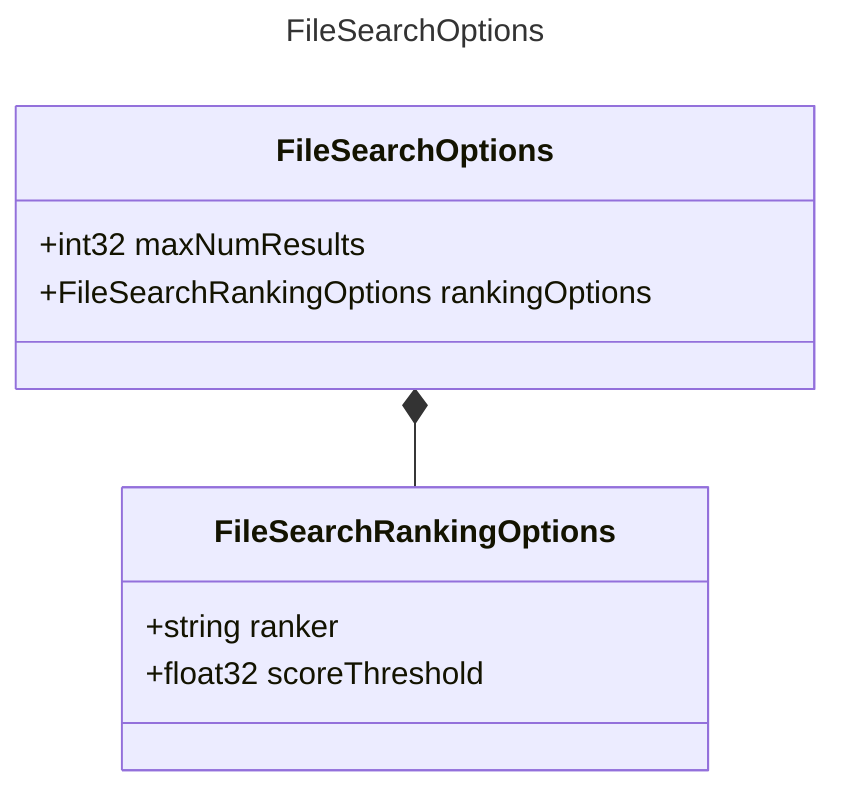

# FileSearchOptions

Options for file search.

## Class Diagram

## Properties

| Name | Type | Description |
| ---- | ---- | ----------- |
| maxNumResults | int32 | The maximum number of search results to return.  |
| rankingOptions | [FileSearchRankingOptions](FileSearchRankingOptions.md) | Options for ranking file search results.  |

