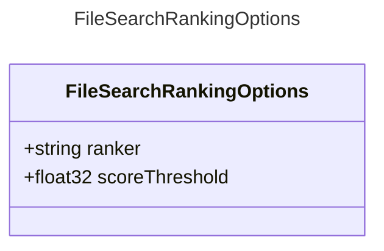

# FileSearchRankingOptions

Options for ranking file search results.

## Class Diagram

## Properties

| Name | Type | Description |
| ---- | ---- | ----------- |
| ranker | string | File search ranker.  |
| scoreThreshold | float32 | Ranker search threshold.  |

