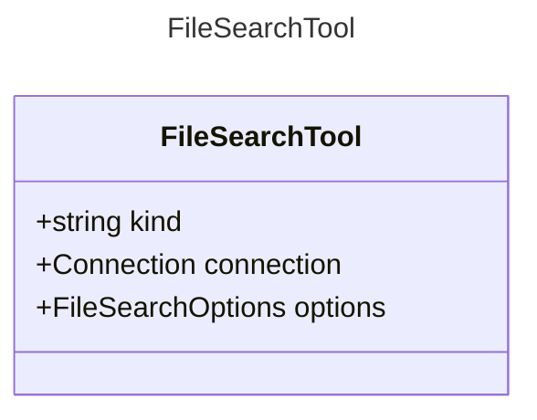

# FileSearchTool

A tool for searching files.
This tool allows an AI agent to search for files based on a query.

## Class Diagram

## Properties

| Name | Type | Description |
| ---- | ---- | ----------- |
| kind | string | The kind identifier for file search tools  |
| connection | [Connection](Connection.md) | The connection configuration for the file search tool  |
| options | [FileSearchOptions](FileSearchOptions.md) | The options for the file search tool  |

