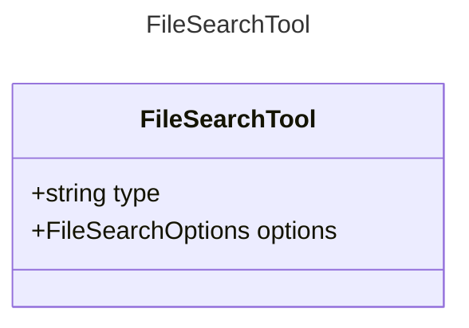

# FileSearchTool

A tool for searching files.
This tool allows an AI agent to search for files based on a query.

## Class Diagram

## Properties

| Name | Type | Description |
| ---- | ---- | ----------- |
| type | string | The type identifier for file search tools  |
| options | [FileSearchOptions](FileSearchOptions.md) | The options for the file search tool  |

