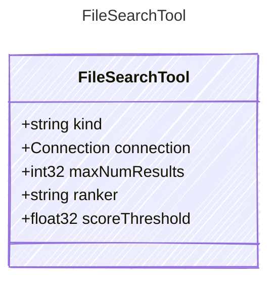

# FileSearchTool

A tool for searching files.
This tool allows an AI agent to search for files based on a query.

## Class Diagram



## Yaml Example

```yaml
kind: file_search
connection:
  id: connectionId
maxNumResults: 10
ranker: default
scoreThreshold: 0.5

```

## Properties

| Name | Type | Description |
| ---- | ---- | ----------- |
| kind | string | The kind identifier for file search tools  |
| connection | [Connection](Connection.md) | The connection configuration for the file search tool  |
| maxNumResults | int32 | The maximum number of search results to return.  |
| ranker | string | File search ranker.  |
| scoreThreshold | float32 | Ranker search threshold.  |
