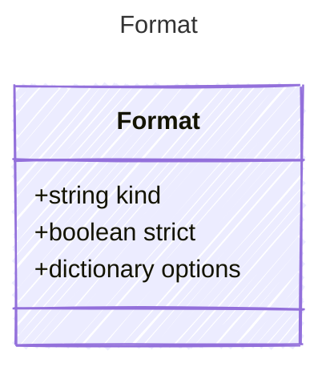

# Format

Template format definition

## Class Diagram



## Yaml Example

```yaml
kind: mustache
strict: true
options:
  key: value

```

## Properties

| Name | Type | Description |
| ---- | ---- | ----------- |
| kind | string | Template rendering engine used for slot filling prompts (e.g., mustache, jinja2)  |
| strict | boolean | Whether the template can emit structural text for parsing output  |
| options | dictionary | Options for the template engine  |

## Alternate Constructions

The following alternate constructions are available for `Format`.
These allow for simplified creation of instances using a single property.

### string format

Simple construction with just a &quot;kind&quot; string

The following simplified representation can be used:

```yaml
format: "example"

```

This is equivalent to the full representation:

```yaml
format:
  kind: "example"

```
