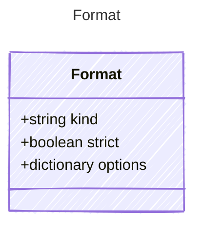

# Format

## Class Diagram

## Properties

| Name | Type | Description |
| ---- | ---- | ----------- |
| kind | string | Template rendering engine used for slot filling prompts (e.g., mustache, jinja2)  |
| strict | boolean | Whether the template can emit structural text for parsing output  |
| options | dictionary | Options for the template engine  |
