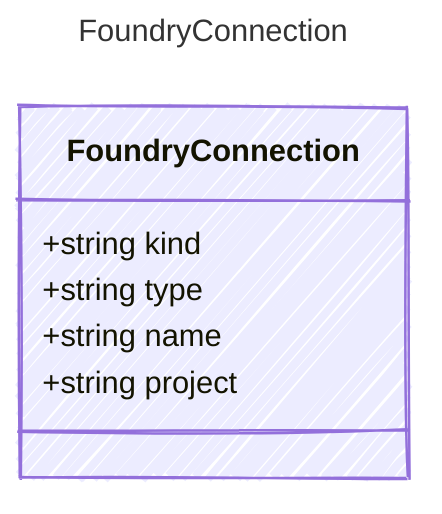

# FoundryConnection

## Class Diagram



## Yaml Example

```yaml
kind: foundry
type: index
name: my-foundry-connection
project: my-foundry-project

```

## Properties

| Name | Type | Description |
| ---- | ---- | ----------- |
| kind | string | The Authentication kind for the AI service (e.g., &#39;key&#39; for API key, &#39;oauth&#39; for OAuth tokens)  |
| type | string | The Foundry endpoint URL for the AI service  |
| name | string | The Foundry connection name  |
| project | string | The Foundry project name  |
