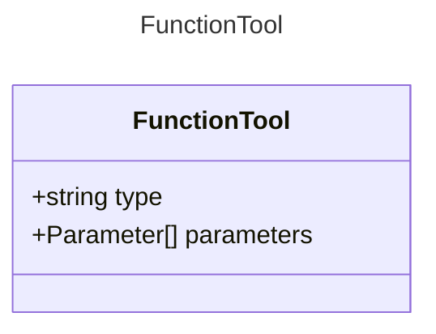

# FunctionTool

Represents a local function tool.

## Class Diagram




## Yaml Example
```yaml
parameters:
  param1:
    type: string
  param2:
    type: number

```


## Properties

| Name | Type | Description |
| ---- | ---- | ----------- |
| type | string | The type identifier for function tools  |
| parameters | [Parameter Collection](Parameter.md) | Parameters accepted by the function tool <p>Related Types:<ul><li>[ObjectParameter](ObjectParameter.md)</li><li>[ArrayParameter](ArrayParameter.md)</li></ul></p> |


