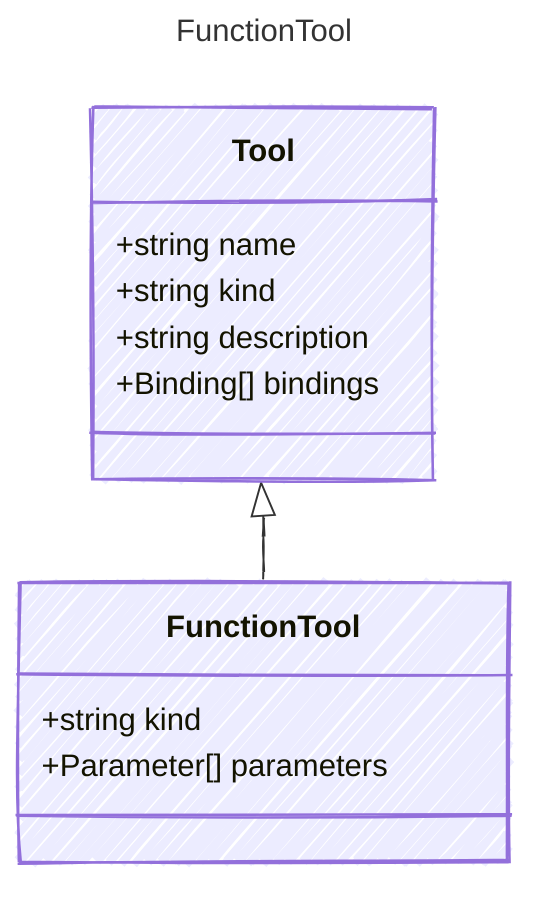

# FunctionTool

Represents a local function tool.

## Class Diagram



## Yaml Example

```yaml
kind: function
parameters:
  param1:
    kind: string
  param2:
    kind: number

```

## Properties

| Name | Type | Description |
| ---- | ---- | ----------- |
| kind | string | The kind identifier for function tools  |
| parameters | [Parameter[]](Parameter.md) | Parameters accepted by the function tool  |
