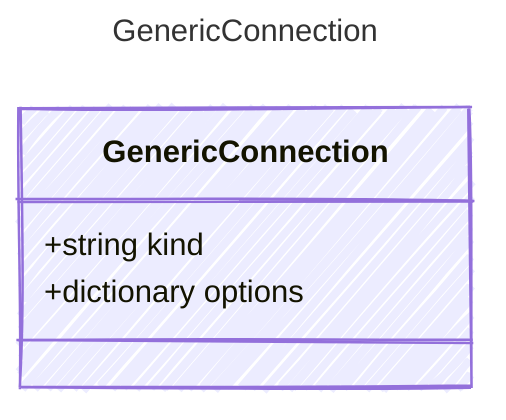

# GenericConnection

## Class Diagram

## Properties

| Name | Type | Description |
| ---- | ---- | ----------- |
| kind | string | The Authentication kind for the AI service (e.g., &#39;key&#39; for API key, &#39;oauth&#39; for OAuth tokens)  |
| options | dictionary | Additional options for the connection  |
