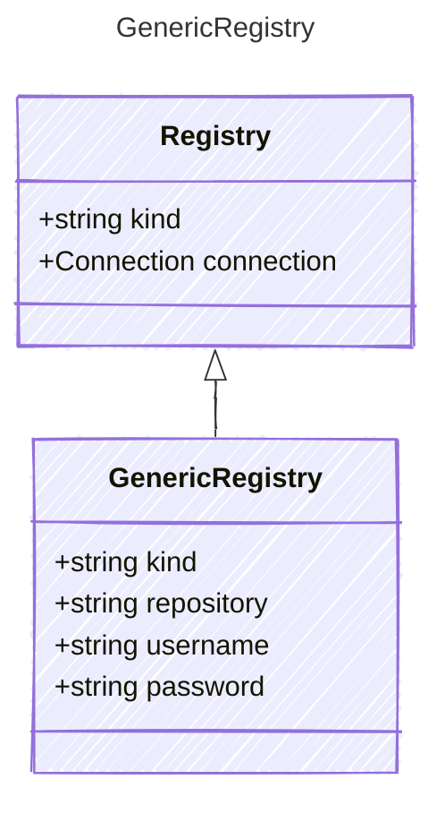

# GenericRegistry

Definition for a generic container image registry.

## Class Diagram



## Yaml Example

```yaml
kind: some-value
repository: https://my-registry.com
username: my-username
password: my-password

```

## Properties

| Name | Type | Description |
| ---- | ---- | ----------- |
| kind | string | The kind of container registry  |
| repository | string | The URL of the container registry  |
| username | string | The username for accessing the container registry  |
| password | string | The password for accessing the container registry  |
