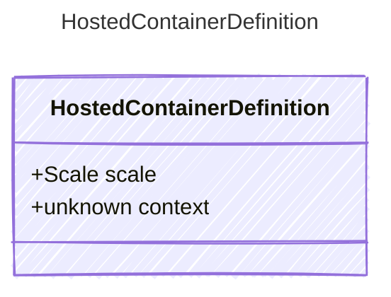

# HostedContainerDefinition

Definition for a containerized AI agent hosted by the provider.
This includes the container registry information and scaling configuration.

## Class Diagram



## Yaml Example

```yaml
scale:
  minReplicas: 1
  maxReplicas: 5
  cpu: 0.5
  memory: 2
context:
  dockerfile: dockerfile
  buildContext: .

```

## Properties

| Name | Type | Description |
| ---- | ---- | ----------- |
| scale | [Scale](Scale.md) | Instance scaling configuration  |
| context | unknown | Container context for building the container image  |
