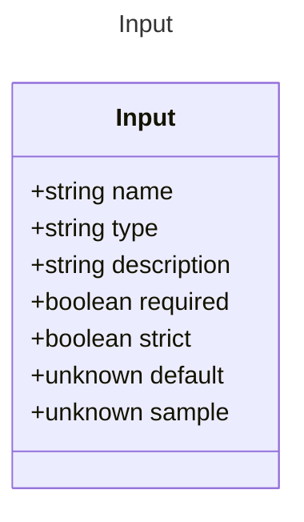

# Input

Represents a single input property for a prompt.
* This model defines the structure of input properties that can be used in prompts,
including their type, description, whether they are required, and other attributes.
* It allows for the definition of dynamic inputs that can be filled with data
and processed to generate prompts for AI models.
* Example:
```yaml
inputs:
  property1: string
  property2: number
  property3: boolean
```

## Class Diagram




## Properties

| Name | Type | Description |
| ---- | ---- | ----------- |
| name | string | Name of the input property  |
| type | string | The data type of the input property  |
| description | string | A short description of the input property  |
| required | boolean | Whether the input property is required  |
| strict | boolean | Whether the input property can emit structural text when parsing output  |
| default | unknown | The default value of the input  |
| sample | unknown | A sample value of the input for examples and tooling  |


