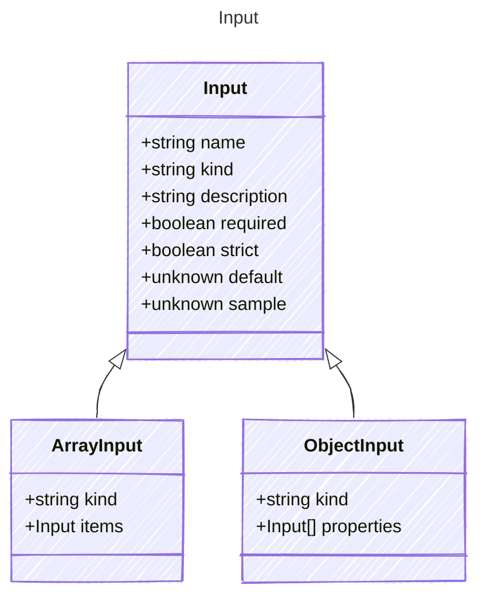

# Input

Represents a single input property for a prompt.

* This model defines the structure of input properties that can be used in prompts,
including their type, description, whether they are required, and other attributes.
* It allows for the definition of dynamic inputs that can be filled with data
and processed to generate prompts for AI models.

## Class Diagram



## Yaml Example

```yaml
name: my-input
kind: string
description: A description of the input property
required: true
strict: true
default: default value
sample: sample value

```

## Properties

| Name | Type | Description |
| ---- | ---- | ----------- |
| name | string | Name of the input property  |
| kind | string | The data type of the input property  |
| description | string | A short description of the input property  |
| required | boolean | Whether the input property is required  |
| strict | boolean | Whether the input property can emit structural text when parsing output  |
| default | unknown | The default value of the input - this represents the default value if none is provided  |
| sample | unknown | A sample value of the input for examples and tooling  |

## Child Types

The following types extend `Input`:

* [ArrayInput](ArrayInput.md)
* [ObjectInput](ObjectInput.md)

## Alternate Constructions

The following alternate constructions are available for `Input`.
These allow for simplified creation of instances using a single property.

### boolean input

Simple construction with just a kind of boolean

The following simplified representation can be used:

```yaml
input: true

```

This is equivalent to the full representation:

```yaml
input:
  kind: boolean
  sample: true

```

### float input

Simple construction with just a kind of float

The following simplified representation can be used:

```yaml
input: 3.14

```

This is equivalent to the full representation:

```yaml
input:
  kind: number
  sample: 3.14

```

### integer input

Simple construction with just a kind of integer

The following simplified representation can be used:

```yaml
input: 5

```

This is equivalent to the full representation:

```yaml
input:
  kind: number
  sample: 5

```

### string input

Simple construction with just a kind of string

The following simplified representation can be used:

```yaml
input: "example"

```

This is equivalent to the full representation:

```yaml
input:
  kind: string
  sample: "example"

```
