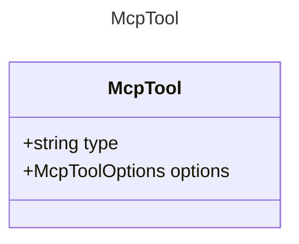

# McpTool

The MCP Server tool.

## Class Diagram

## Properties

| Name | Type | Description |
| ---- | ---- | ----------- |
| type | string | The type identifier for MCP tools  |
| options | [McpToolOptions](McpToolOptions.md) | The options for the MCP tool  |

