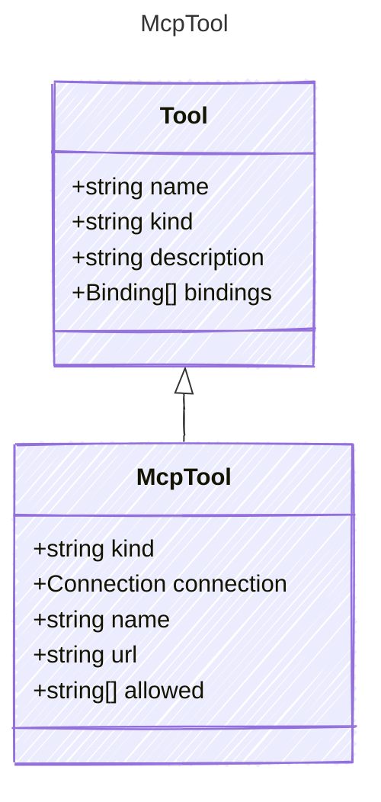

# McpTool

The MCP Server tool.

## Class Diagram



## Yaml Example

```yaml
kind: mcp
connection:
  kind: provider-connection
name: My MCP Tool
url: https://mcp.server.com
allowed:
  - operation1
  - operation2

```

## Properties

| Name | Type | Description |
| ---- | ---- | ----------- |
| kind | string | The kind identifier for MCP tools  |
| connection | [Connection](Connection.md) | The connection configuration for the MCP tool  |
| name | string | The name of the MCP tool  |
| url | string | The URL of the MCP server  |
| allowed | string[] | List of allowed operations or resources for the MCP tool  |
