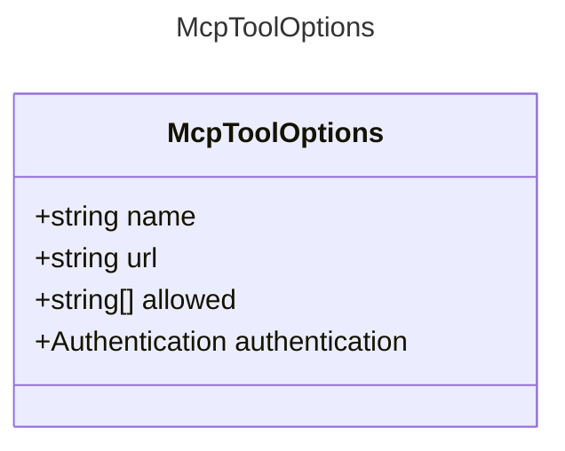

# McpToolOptions

Configuration options for the MCP tool.

## Class Diagram

## Properties

| Name | Type | Description |
| ---- | ---- | ----------- |
| name | string | The name of the MCP tool  |
| url | string | The URL of the MCP server  |
| allowed | string Collection | List of allowed operations or resources for the MCP tool  |
| authentication | [Authentication](Authentication.md) | Authentication configuration for the MCP tool  |

