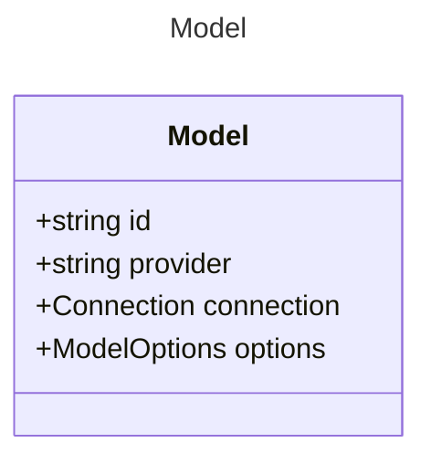

# Model

Model for defining the structure and behavior of AI agents.
Yaml Example:
```yaml
name: Basic Prompt
description: A basic prompt that uses the GPT-3 chat API to answer questions
model:
  id: gpt-35-turbo
  connection:
    provider: azure
    type: chat
    endpoint: https://{your-custom-endpoint}.openai.azure.com/
```

A shorthand representation of the model configuration can also be constructed as
follows:
```yaml
name: Basic Prompt
description: A basic prompt that uses the GPT-3 chat API to answer questions
model: gpt-35-turbo
```
This will be expanded as follows:
```yaml
name: Basic Prompt
description: A basic prompt that uses the GPT-3 chat API to answer questions
model:
  id: gpt-35-turbo
```

## Class Diagram




## Yaml Example
```yaml
id: gpt-35-turbo
provider: azure
connection:
  authType: key
  endpoint: https://{your-custom-endpoint}.openai.azure.com/
options:
  type: chat
  temperature: 0.7
  maxTokens: 1000

```


## Properties

| Name | Type | Description |
| ---- | ---- | ----------- |
| id | string | The unique identifier of the model - can be used as the single property shorthand  |
| provider | string | The provider of the model (e.g., &#39;openai&#39;, &#39;azure&#39;, &#39;anthropic&#39;)  |
| connection | [Connection](Connection.md) | The connection configuration for the model <p>Related Types:<ul><li>[KeyConnection](KeyConnection.md)</li><li>[OAuthConnection](OAuthConnection.md)</li></ul></p> |
| options | [ModelOptions](ModelOptions.md) | Additional options for the model  |


