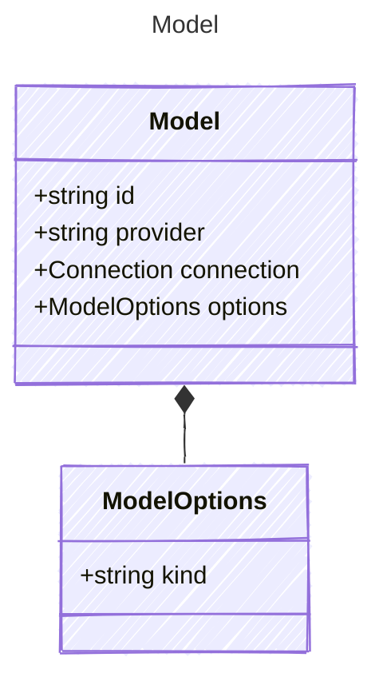

# Model

Model for defining the structure and behavior of AI agents.
This model includes properties for specifying the model&#39;s provider, connection details, and various options.
It allows for flexible configuration of AI models to suit different use cases and requirements.

## Class Diagram



## Yaml Example

```yaml
id: gpt-35-turbo
provider: azure
connection:
  authType: key
  endpoint: https://{your-custom-endpoint}.openai.azure.com/
options:
  type: chat
  temperature: 0.7
  maxTokens: 1000

```

## Properties

| Name | Type | Description |
| ---- | ---- | ----------- |
| id | string | The unique identifier of the model - can be used as the single property shorthand  |
| provider | string | The provider of the model (e.g., &#39;openai&#39;, &#39;azure&#39;, &#39;anthropic&#39;)  |
| connection | [Connection](Connection.md) | The connection configuration for the model  |
| options | [ModelOptions](ModelOptions.md) | Additional options for the model  |

## Composed Types

The following types are composed within `Model`:

- [ModelOptions](ModelOptions.md)

## Alternate Constructions

The following alternate constructions are available for `Model`.
These allow for simplified creation of instances using a single property.

### string model

Simple construction with just an id

The following simplified representation can be used:

```yaml
model: "example"

```

This is equivalent to the full representation:

```yaml
model:
  id: "example"

```
